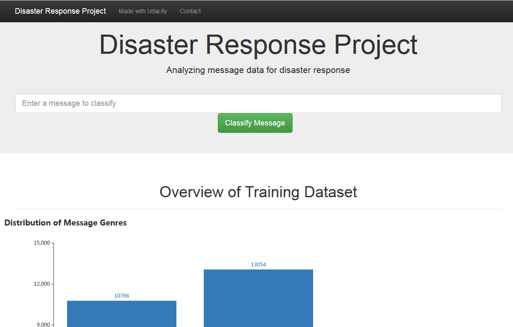

# Disaster Response Pipeline 

## Table of Contents

- [Project Overview](#overview)
- [Project Components](#components)
  - [ETL Pipeline](#etl_pipeline)
  - [ML Pipeline](#ml_pipeline)
  - [Flask Web App](#flask)
- [Quick Start](#run)
- [Files](#files)
- [Licensing and Acknowledgements](#credits)

***

<a id='overview'></a>

## 1. Project Overview

In this project , I have built pipelines of ETL and Machine Learning Model to categorize disaster data from  [Figure Eight](https://www.figure-eight.com/) , and developed a web application to visualize the results and classified disaster messages .

Below are a few screenshots of the web app.




<a id='components'></a>

## 2. Project Components

There are three components of this project:

<a id='etl_pipeline'></a>

### 2.1. ETL Pipeline

File `data/process_data.py` contains data cleaning pipeline that:

- Loads the `messages` and `categories` dataset
- Merges the two datasets
- Cleans the data
- Stores it in a SQLite database

<a id='ml_pipeline'></a>

### 2.2. ML Pipeline

File `models/train_classifier.py` contains machine learning pipeline that:

- Loads data from the SQLite database
- Splits the data into training and testing sets
- Builds a text processing and machine learning pipeline
- Trains and tunes a model using GridSearchCV
- Outputs result on the test set
- Exports the final model as a pickle file

<a id='flask'></a>

### 2.3. Flask Web App

<a id='eg'></a>

This web application designed with bootstrap to:

- Process and visualize the cleaned data using Pyecharts
- Classifier message from user input, and display the predicted disaster categories

<a id='run'></a>

## 3. Quick Start

1. Run the following commands in the project's root directory to set up your database and model.
   - To run ETL pipeline that cleans data and stores in database
     `python data/process_data.py data/disaster_messages.csv data/disaster_categories.csv data/DisasterResponse.db`
   - To run ML pipeline that trains classifier and saves
     `python models/train_classifier.py data/DisasterResponse.db models/classifier.pkl`
2. Run the following command in the app's directory to run your web app.
   `python run.py`
3. Go to http://127.0.0.1:5000/

<a id='files'></a>

## 4. Files

```
├── app/
│   ├── run.py------------------------# FLASK FILE THAT RUNS APP
│   ├── static
│   │   └── favicon.ico---------------# FAVICON FOR THE WEB APP
│   └── templates
│       ├── go.html-------------------# CLASSIFICATION RESULT PAGE OF WEB APP
│       └── master.html---------------# MAIN PAGE OF WEB APP
├── data/
│   ├── disaster_categories.csv-------# DATA TO PROCESS
│   ├── disaster_messages.csv---------# DATA TO PROCESS
│   └── process_data.py---------------# ETL PIPELINE
├── imgs------------------------------# SCREENSHOTS OF THE WEB APP
├── models/
│   └── train_classifier.py-----------# MACHINE LEARNING PIPELINE
```

<a id='credits'></a>

## 5. Licensing/ Acknowledgements

Must give credit to [Figure-eight](https://www.figure-eight.com/) for the data and [Udacity](https://www.udacity.com/courses/all) for creating a beautiful learning experience.

<a rel="license" href="http://creativecommons.org/licenses/by-nc/4.0/"></a>